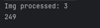
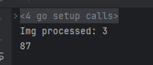

# Processamento Utilizando Golang

Este repositório tem como objetivo testar o processamento de imagens utlizando a linguagem Go e *goroutines*.

## Execução sem Goroutines

Sem a utilizar Goroutines, o programa executou 3 imagens em 249 milisegundos.

## Execução com Goroutines

Com utilização de Goroutines, o programa executou 3 imagens em 87 milisegundos.

Referencias:

* [youtube](https://www.youtube.com/watch?v=neVAU4DPqIc)